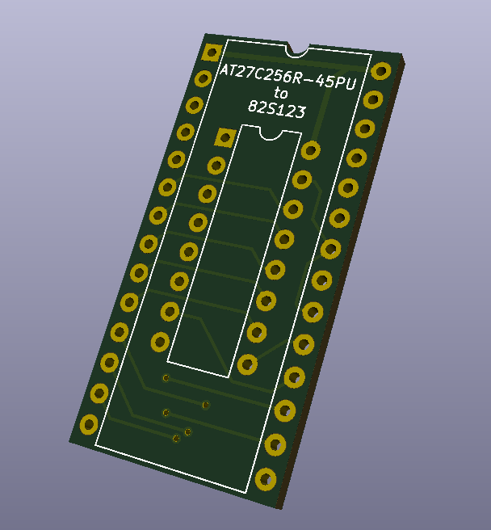
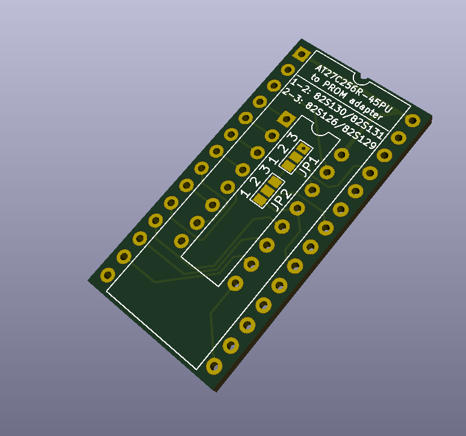
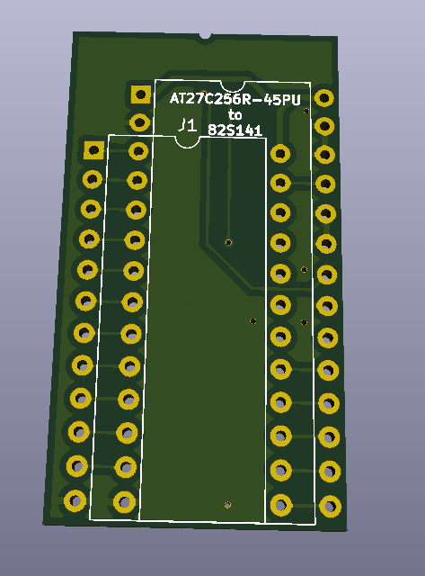
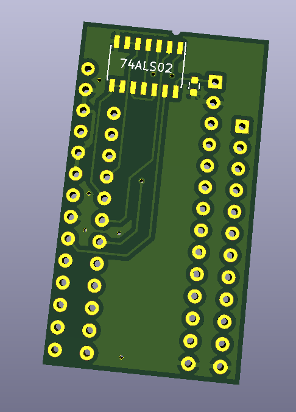

# 27C256 to PROM Adapter

The purpose of this repo is to replace the old obselete PROMs. It is recommended that you use the Atmel AT27C256-45PU. It is a very fast OTP EPROM that can be purchased from reputable sellers such as mouser.com. All board designs are done in Kicad.

*Just as a disclaimer, these are not garunteed to work with everything. Not all of the adapters have been verified to work. As these are verified working, the table will be updated.*

## Chip Verification
| Chip   | Boards Made? | Verified Working? | Test Details                                                                      |
|--------|--------------|-------------------|-----------------------------------------------------------------------------------|
| 82S123 | No           | No                | Untested                                                                          |
| 82S126 | Yes          | No                | Untested                                                                          |
| 82S129 | Yes          | Yes               | Tested audio PROM 1D and Color PROM 1C on Galaga, ran for 4 hours with no issues  |
| 82S130 | Yes          | No                | Untested                                                                          |
| 82S131 | Yes          | No                | Untested                                                                          |
| 82S137 | No           | No                | Untested                                                                          |
| 82S141 | No           | No                | Untested                                                                          |
| 82S141 | No           | No                | Untested                                                                          |
| 82S147 | No           | No                | Untested                                                                          |
|TKG Elim| Yes          | Yes               | Tested working on a TRS2 Radarscope PCB set. Ran with no issues.                  |

## 82S123
Just a drop in replacement, no jumpers or anything. Just solder the pins, burn the rom, then solder the rom and insert in the socket!

## 82S126/82S129/82S130/82S131
There are two jumpers, for 82S130/82S131, jump pins 1 and 2 for both jumper sets. For 82S126/82S129, jump pins 2 and 3 for both jumper sets. One thing to note with this, only the 4 low bits are used with this one. Make sure your binaries are not using the data in the upper bits.

## 82S137
Just a drop in replacement, no jumpers or anything. Just solder the pins, burn the rom, then solder the rom and insert in the socket! One thing to note with this, only the 4 low bits are used with this one. Make sure your binaries are not using the data in the upper bits.

## 82S141
This one is a little bit different, it uses active circuitry to combine the chip select. It basically adds a 74ALS02 and a 0.1uF 0603 sized capacitor. The reason is because the 82S141 has four chip enables where as the 27C256 only has two. 

## TKG CPU PROM Eliminator
This is a board that combines the two PROMs found on the CPU board of Donkey Kong and Radarscope PCBs. It is more of an application than a direct PROM adapter. View the readme in the TKG CPU Eliminator folder for more details.

This has been tested and verified working on a TRS2 Radarscope PCB, but should be compatible with the following game boards:
- Radarscope (TRS2)
- Donkey Kong (TKG2)
- Donkey Kong (TKG3)
- Donkey Kong (TKG4)

