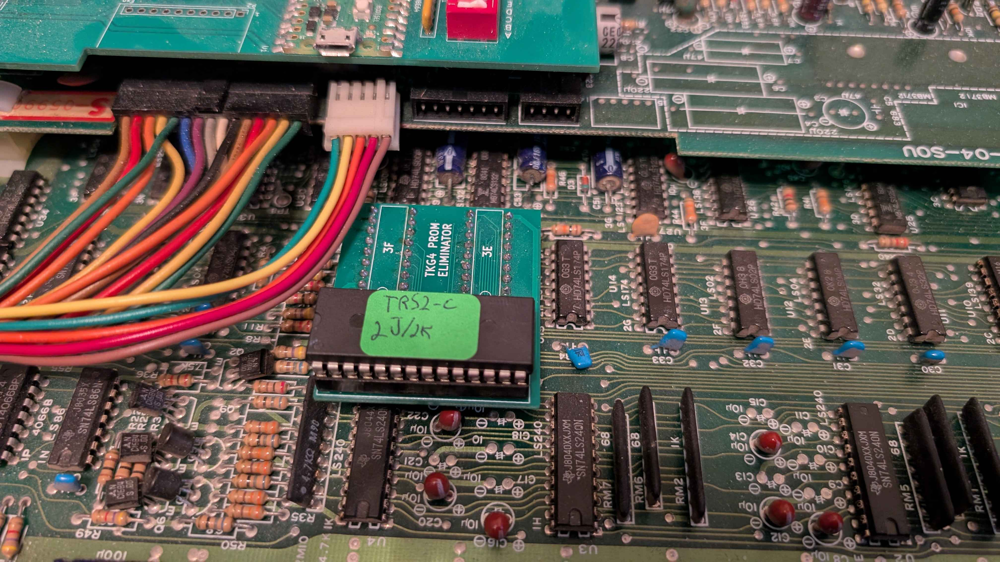
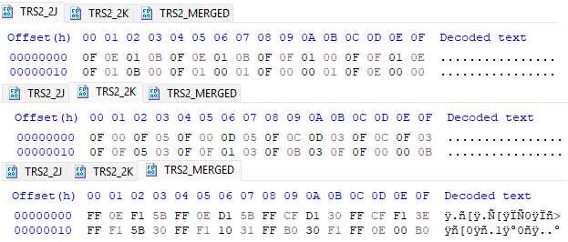

# TKG PROM Eliminator
This board was designed as an alternative to the bipolar PROMs commonly found on Radarscope and Donkey Kong CPU PCBs. This combines both PROMs into one single IC to save on chips in the event that the PROMs are missing or defective. Note, this is intended to be used with **AT27C256R-45PU** high speed EPROMs. These are still available as of this time, so it makes a suitable alternative. It fits into the original two sockets without any board modifications. 



## Combining the PROM Files
Because this board relies on combining both of these PROMs into one (both are 4 bit), one has to be the upper bits and the other has to be the lower bits. 2J/3E is the lower bits, 2K/3F is the upper bits. A python script has been provided to combine the files.

Use of the python script is not required. However, I wrote it so that manual shifting of the bits and merging is unecessary. The upper PROM files have to have their byte contents shifted left by 4 and then merged together. This can be done manually but is quite tedious and prone to error. The example down shows a partial merge of the first 32 bytes.



### Using the python script
The only pre-requisite is that you have to have a newer version of Python 3 installed on your computer. In order to use the python script, you will have to define the file names that you want to use in the header of the python script. You will also have to copy your PROM files into the "Scripts" folder in order to merge them.

```python
#user defined file names
promLowFilename = "TRS2_2J"
promHighFilename = "TRS2_2K"
promMergedFilename = "TRS2_MERGED"
```

promLowFilename is the file name of the 2J or 3E PROM, this is the lower bits. promHighFilename is the file name of the 2K/3F PROM, this is the upper bits. promMergedFilename is output file name.

A simple bat file is provided to easily execute it, it assumes that you have "python" as an environment variable. If you do not have that, then you will need to execute the python script another way.

### Burning the EPROM
You do not have to do anything special to burnt he eprom once you have the merged file. Duplicating to fill the EPROM is unecessary. Just load the merged PROM files at the beginning of memory for your programmer perform the programming.